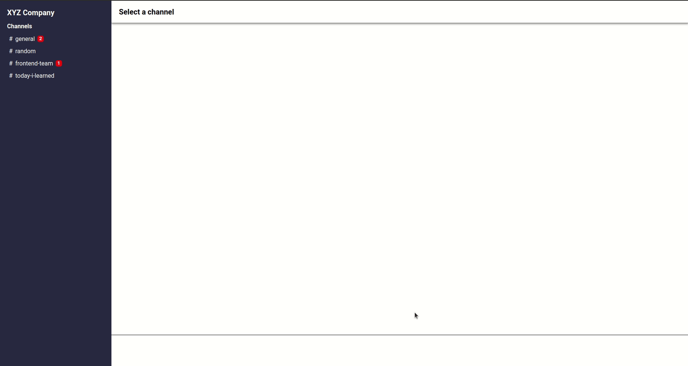

# React Triibo Challenge
> A chat screen maded width React and Typescript



## Development Manual

This project was made with React together with the following technologies:

- <b>[Yarn](https://yarnpkg.com/)</b>: Yarn is a faster and more secure package manager than the standard NodeJS package manager.

- <b>[Typescript](https://www.typescriptlang.org/)</b>: The javascript superset that allows us to use the latest Ecmascript features, in addition to being compiled and having strong typing, giving us more stability and clarity.

- <b>[Styled-components](https://styled-components.com/)</b>: A css-in-js library that allows us to style components in a simple way, in addition to being able to pass properties into the style, making it reactive.

- <b>[Redux](https://redux.js.org/)</b>: This library allows us to manage global states within the application.

- <b>[Eslint](https://eslint.org/)</b>: This tool helps us to find code pattern problems, analyzing the code and informing us of the pattern errors found.

- <b>[Prettier](https://prettier.io/)</b>: The preetier tool helps us to maintain good code formatting.

---

* ### Instalation

Before starting the installation, create an .env file at the root of the project with the following variable:

```
SKIP_PREFLIGHT_CHECK=true
```
Ps: This will fix the compatibility errors for eslint dependencies.

After, run the following command:

```sh
yarn
```

To start the project on localhost, run:

```sh
yarn start
```

---

* ### Project Structure

```
├── package.json
├── prettier.config.js
├── public
│   ├── favicon.ico
│   ├── index.html
│   ├── logo192.png
│   ├── logo512.png
│   ├── manifest.json
│   ├── robots.txt
│   └── triibo-logo.png
├── README.md
├── src
│   ├── App.tsx
│   ├── components
│   │   ├── ChannelChat
│   │   │   ├── index.tsx
│   │   │   └── styles.ts
│   │   ├── ChannelList
│   │   │   ├── index.tsx
│   │   │   └── styles.ts
│   │   ├── ChannelName
│   │   │   ├── index.tsx
│   │   │   └── styles.ts
│   │   ├── Layout
│   │   │   ├── index.tsx
│   │   │   └── styles.ts
│   │   └── MessageInput
│   │       ├── index.tsx
│   │       └── styles.ts
│   ├── index.tsx
│   ├── react-app-env.d.ts
│   ├── store
│   │   ├── actions
│   │   │   └── channelActions.ts
│   │   ├── index.ts
│   │   └── reducers
│   │       ├── channelReducer.ts
│   │       └── index.ts
│   ├── styles
│   │   └── GlobalStyles.ts
│   └── utils
│       └── api.json
├── tsconfig.json
└── yarn.lock
```

## Meta

Linkedin Profile – [Messias Geovani](https://www.linkedin.com/in/messias-geovani-00125416a?lipi=urn%3Ali%3Apage%3Ad_flagship3_profile_view_base_contact_details%3BGnSoFwiETD%2BtGrv4dF9mSw%3D%3D) 

Email – messias.geovani.lima@gmail.com

Github profile – [messiasGeovani](https://github.com/messiasGeovani)

## Contributing

1. Fork it (<https://github.com/messiasGeovani/react_triibo_challenge/fork>)
2. Create your feature branch (`git checkout -b feature/fooBar`)
3. Commit your changes (`git commit -am 'Add some fooBar'`)
4. Push to the branch (`git push origin feature/fooBar`)
5. Create a new Pull Request
